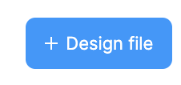
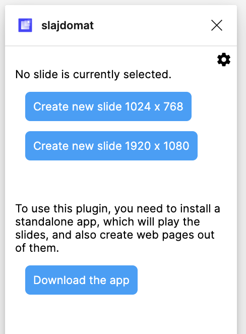
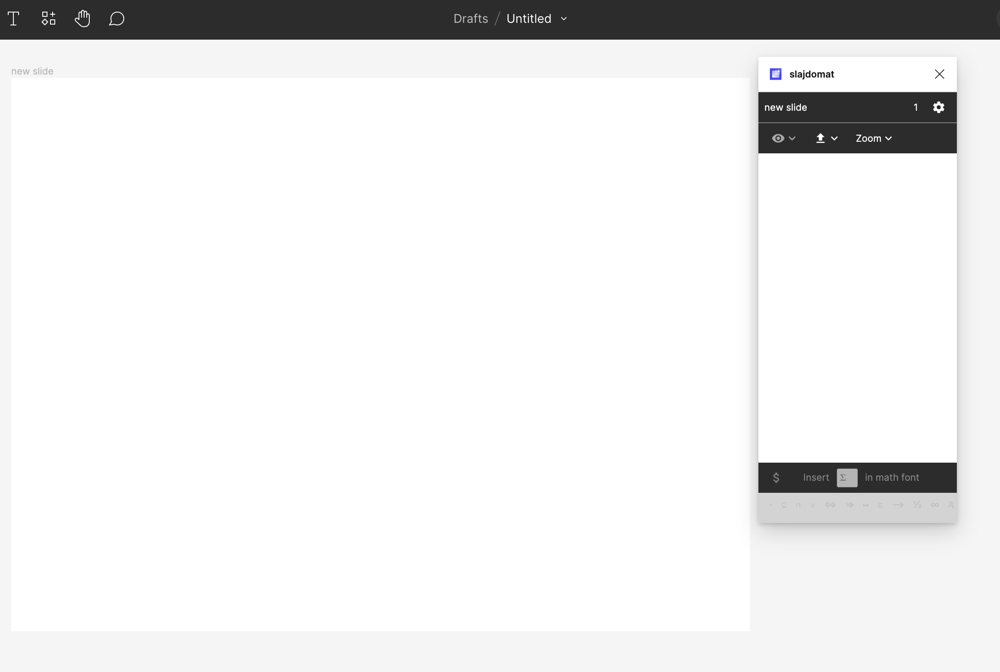
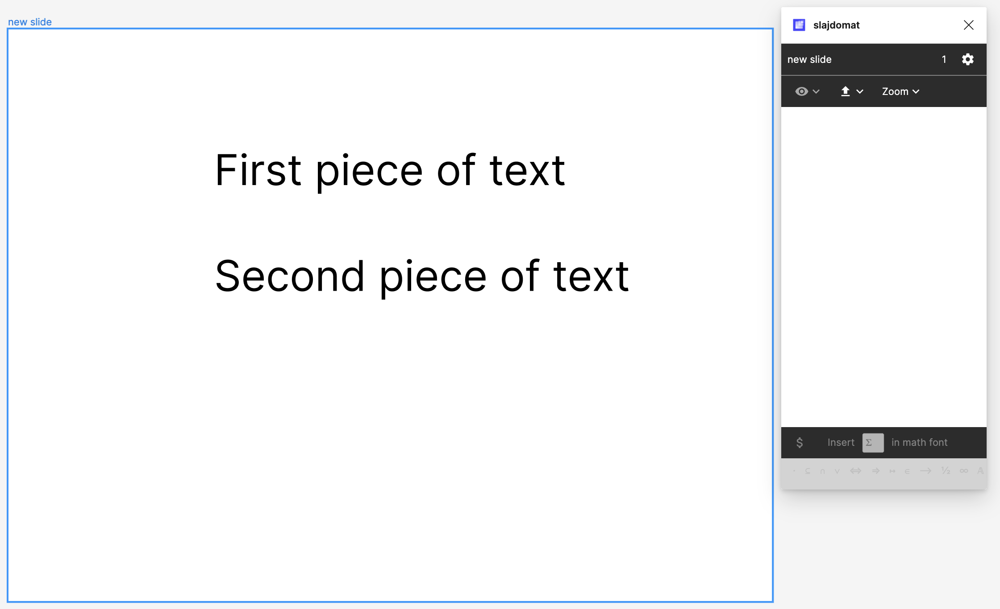
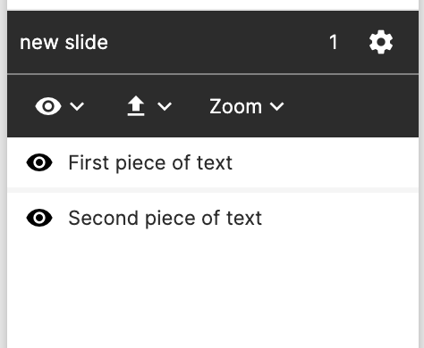

# User guide

Slajdomat is a tool for making zooming slides in Figma. You draw your slides in Figma, which is a good drawing program that can be used for free (you can also apply for an education plan which removes some limits of the free version). You use the Slajdomat plugin in Figma to annotate your picture with slide information (in what order the images should appear as slides). Then, you export the slides, with the result being html that you can upload to your website.

Main features
- uses Figma, a quality drawing program and free for basic use
- zoom in and zoom out
- allows recording sound
- produces html, hopefully not bloated
- has some math and latex support

## How to install

You will need the following software: 
-  **Figma**. This is available on Mac and Windows ([downloads](https://www.figma.com/downloads/)), and unofficially on  Linux ([downloads](https://github.com/Figma-Linux/figma-linux)). You can also use it as a web page, but this will not work on a plane/train, which is a typical slide making environment.
- **Slajdomat plugin in Figma.** You add Slajdomat to Figma by choosing the plugin in the &lsquo;Plugins&rsquo;&nbsp; menu of Figma. 
- **Slajdomat app.**  A standalone program, which will complie your slides, display them, and upload them to your webpage. You [can find versions for Mac, Windows and Linux at github](https://github.com/bojanczyk/slajdomat/releases). Embarrassingly, the app is the size of chrome, since it contains a copy of chrome (this is how many cross-platform programs are developed nowadays).

[Tutorial](tutorial.md)

## Tutorial

We begin in Figma by creating some content.

### Create content in Figma
In Figma, create a new design file (which will be a presentation) using this button:

You will get an empty project. Now open the Slajdomat plugin (from the plugins menu). When opened in an empty design file, it should look like this: 

Click the slide size that you want. (Don't stress too much about the proportions, if the projector has the wrong proportions, your slides will still display.) This will create your first slide, and your screen will look like this:

Now draw some pictures in Figma. In this example, I created two pieces of text. 

Select the two pictures (or any number of pictures), and then click on the eye  icon in the plugin. This will create two events in your slide, which show the two pieces of text. 

You can reorder the two events. When creating the events, the plugin tries to guess the correct order (top-to-bottom, or left-to-right). 

### Exporting

Now we enter the second phase, where the slides are compiled. Make sure that your Slajdomat app is running. 