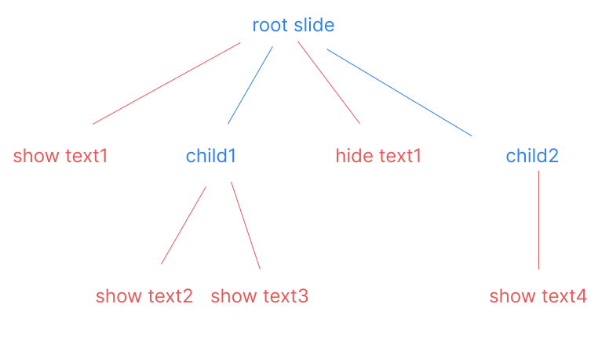
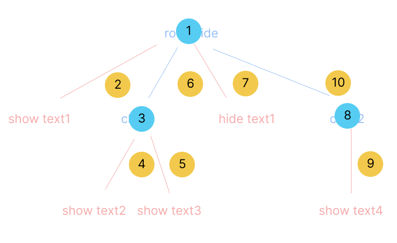

## The components of the system

The system has three parts, which communicate with each other using messages. These parts are:
- the figma plugin (its sources are in src/plugin)
- the electron app (its sources are in src/main and src/renderer)
- the viewer that displays the slides (its sources are in src/viewer)

Both the plugin and the electron app have a frontend/backend structure (imposed by figma and electron, respectively). Overall, the frontend is some html with code that takes care of event listeners, the backend does most of the work. The communication between the frontend and the backend is using messages. 

The communication between the plugin and electron is handled by the frontend on the plugin case, and the backend on the electron case. I would have liked it to be the backend in both cases, but figma disallows communication from the backend. 

## The main data structures

The main data structure is the presentation tree.

    type PresentationNode = OverlayEvent | Slide

 You can find it in src/common/types.ts. In the presentation tree, the leaves are overlays and the internal nodes are slides (i.e. only slides can have children). Each slide is associated to an svg, which is exported by figma. Each slide has a list of children, some of which are slides, and some of which are overlays. The overlays manipulate svg elements of the slide, by showing/hiding elements or moving them around.

Here is a picture of the a slide tree, with Slide nodes in blue and OverlayEvent nodes in red. (In principle, there could be a blue Slide leaf, i.e. a slide that has no children.)
 

The purpose of the plugin is to maintain this tree. It is stored in a file called manifest.json, together with some other annotation, such as the name of the presentation, or lists of sounds (sounds are a longer story). The plugin keeps constructs this tree based on annotation of the figma document, and exports it through websockets to the electron backend, together with svg images for each slide. The electron backend receives these messages, and creates a directory where the manifest is stored, and child sub-directories where the images are stored (and where, eventually, sound files will also be stored).

### How the presentation tree is displayed

The directory created by the electron backend is essentially a web page. It is contains an index.html file, which we call the viewer. The viewer stitches together the svg files based on the tree in the manifest, and displays them to the user.
When the presentation is displayed by the viewer, the slide tree is visited using a depth-first search traversal:
  

Each moment in this traversal is called a state. The states are as follows:

- For each slide node, we begin with a "start" state for this node (the blue circles in the picture).
- Then, for each child of the slide, we traverse its tree, and after that there is an "after" state for the child (the yellow circles in the picture). If the child is an overlay, it does not have any other states, except the "after" state.

Therefore, the "start" states are in one-to-one correspondence with the slides, while the "after" states are in one-to-one correspondence with the tree edges.

This leads us to the second main data structure of the program, which is:

    type State = {
      type: 'start',
      slide: Slide}
    | {
      type: 'afterEvent',
      event: PresentationNode
    }

(todo: this guide should have descriptions of each of the five parts, their main functions, and the communication between them.)

