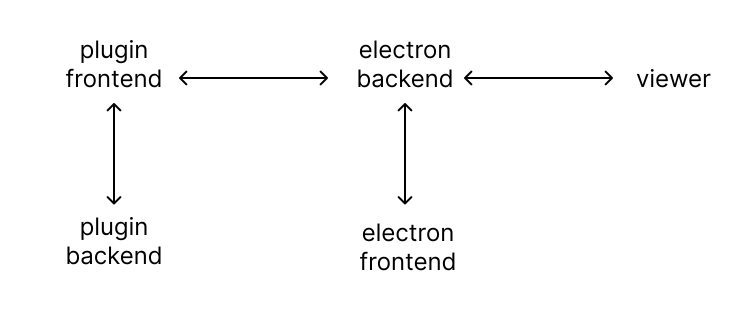

## The components of the system

The system has three parts, which communicate with each other using messages. These parts are:
- the figma plugin (its sources are in src/plugin)
- the electron app (its sources are in src/main and src/renderer)
- the viewer that displays the slides (its sources are in src/viewer)

Both the plugin and the electron app have a frontend/backend structure (imposed by figma and electron, respectively). Overall, the frontend is some html with code that takes care of event listeners, the backend does most of the work. The communication between the frontend and the backend is using messages. 

(todo: this guide should have descriptions of each of the five parts, their main functions, and the communication between them.)

