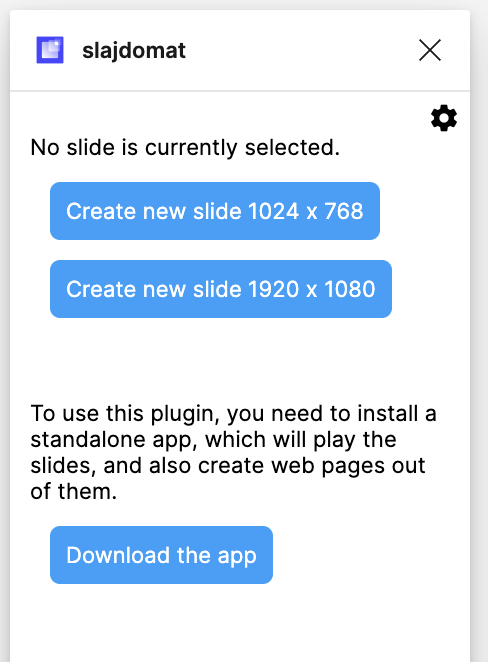
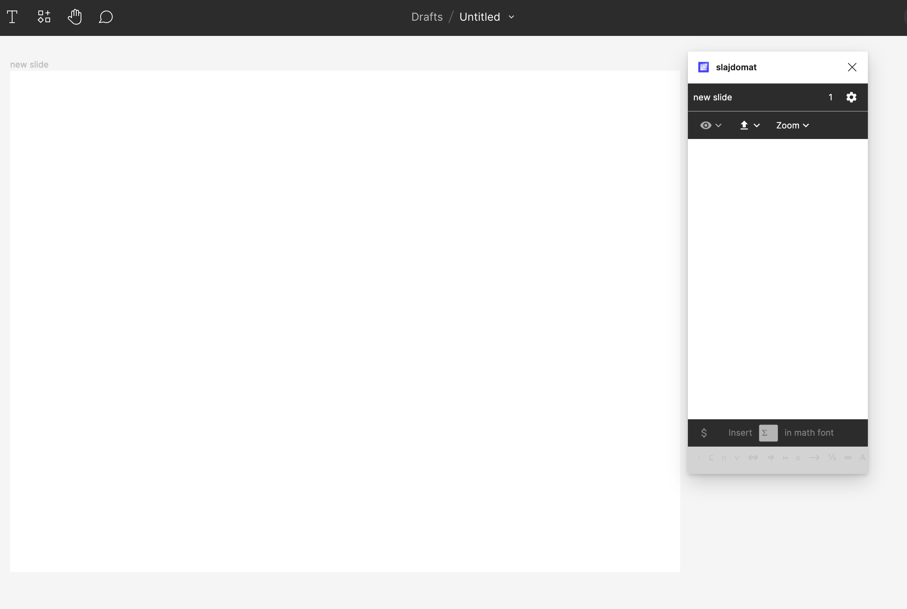
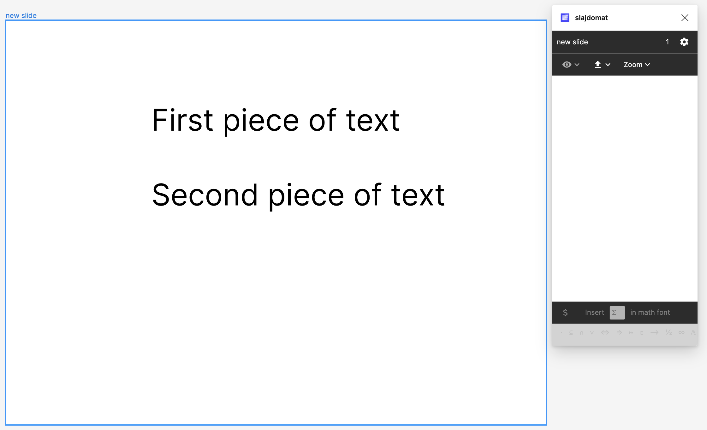

## Tutorial

We begin in Figma by creating some content.

### Create content in Figma
In Figma, create a new design file (which will be a presentation) using this button:

You will get an empty project. Now open the Slajdomat plugin (from the plugins menu). When opened in an empty design file, it should look like this: 

Click the slide size that you want. (Don't stress too much about the proportions, if the projector has the wrong proportions, your slides will still display.) This will create your first slide, and your screen will look like this:

Now, or earlier, is a good time to name your presentation. At the top of the above picture, it says Drafts/Untitled. Click on Untitled to give it a new name, in this tutorial we use "My tutorial example".
Now draw some pictures in Figma. (It should be simple, but otherwise look up a tutorial for figma.) In this example, we created two pieces of text. 

Now we will start telling Slajdomat about the order in which the pictures will be displayed in the slideshow.
Select the two pictures (or any number of pictures), and then click on the eye  icon in the plugin. This will create two events in your slide, which show the two pieces of text. 

The meaning of these two events is that initially the slide is empty, and then the first piece of text appears (when the use presses the "next" button in the presentation), and then the second piece of text appears. If some picture is not part of any event, then it will be visible initially.

You can reorder the two events. When creating the events, the plugin tries to guess the correct order (top-to-bottom, or left-to-right). 

### Exporting

Now we enter the second phase, where the slides are compiled. 
We first run the Slajdomat app, the one that is the size of chrome. When you first run it, you will get a screen that looks like this.

Follow the instructions in the screen, by selecting some folder. A typical solution is to have a sub-folder in your documents folder, called "Slides" or "Slajdomat". You could also use you documents folder. After selecting the folder (in this example, we selected the folder "Slajdomat" in our "Dcouments" folder), the app will look something like this:

Once you have been working with Slajdomat, there will be lots of presentations here. Let's have our first one. Switch back to Figma and the plugin, and click the export button  which is next to the eye button. If all goes well, Figma will tell you that the slides have been successfully exported.

Now go back to the SLajdomat app. You should see your first presentation, like this:

You can click the play button on the left to see this presentation. Keep this window open, and whenever you export again your presentation from Figma (after doing some modifications), you can press reload (Command-R on Mac) in the presentation to see its new version. 

If you click the folder button on the right of your presentation name, then you will see the contents of the folder that stores it.  

If you copy this folder to your website, then it should display as a webpage. There are also tools in Slajdomat to automate copying to your website.