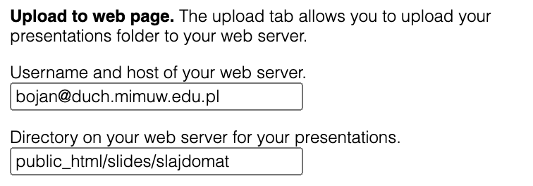

# Uploading your slides

The output of slajdomat is web page. This means that each presentation is a directory, which contains files such as:
- index.html, which is the starting point of the web page
- viewer.js, which contains the javacript for viewing,
- manifest.json, which contains a description of the presentation
- subdirectories, which store the images and sounds for the slides. 

If you copy the presentation directory (i.e. the one that contains the above files) to your web server directory (often a subdirectory called public_html), then you can view your slides through a browser, by setting the presentation directory as the URL. (You do not need to add index.html to the end, since this is default.)

## Upload script
Slajdomat provides an automatic upload script. Assumptions: 

- Your presentations folder should be under git. I have a github repo that is equal to my presentations folder. Git should be configured so that no passwords are needed. This means that 'git push' should run without asking for a password.

- You should have access to a web server to which you can ssh. This means that 'ssh bojan@mimuw.edu.pl', or whatever your credentials are, should run on your local machine without asking for a password. A typical way to avoid passwords is [to configure your ssh known hosts.](https://www.strongdm.com/blog/ssh-passwordless-login) 

- On your web server, there should be a clone of your git repository with the presentations folder. 

In the settings tab, you provide the username/host for the ssh, as well as the local path, inside your account on the web server, of the clone of the repository. Here is a screenshot of the corresponding fields:

Once everything is configured, you can use this button to upload your slides:

The button will do the following: 

- download the comments from the server to your local computer
- upload all slides from your local computer to the server.
