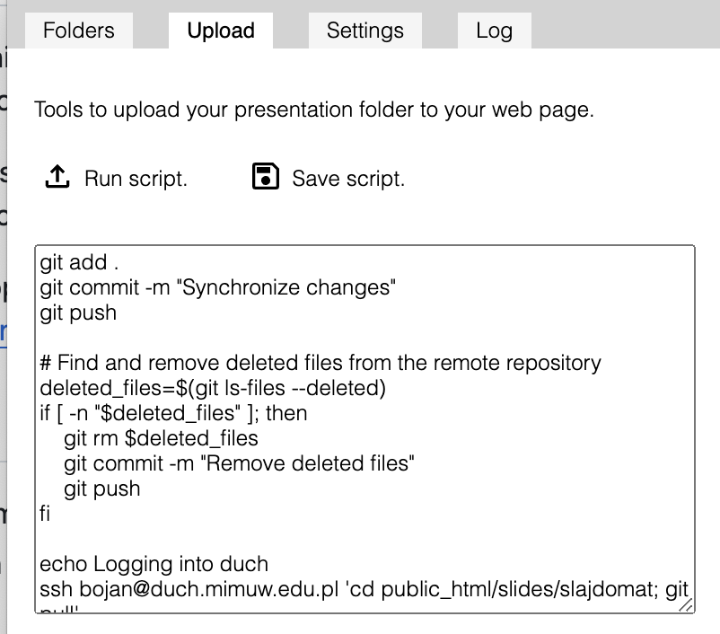

# Uploading your slides

The output of slajdomat is web page. This means that each presentation is a directory, which contains files such as:
- index.html, which is the starting point of the web page
- viewer.js, which contains the javacript for viewing,
- manifest.json, which contains a description of the presentation
- subdirectories, which store the images and sounds for the slides. 

If you copy the presentation directory (i.e. the one that contains the above files) to your web server directory (often a subdirectory called public_html), then you can view your slides through a browser, by setting the presentation directory as the URL. (You do not need to add index.html to the end, since this is default.)

## Upload script
At some point, you might want to have an automatic script to upload your presentations to your web page. This is the purpose of the upload tab, seen in this picture: 

You can enter any shell script here, which will be saved and executed whenever you press the "Run scirpt" button, with the current directory being your slides directory.

### Example upload script

Here is how my upload script works. My slides directory is synchronised with a gitHub repository. The script commits and pushed all changes (rather brutally), then uses ssh to log to my homepage, where git pull is run.  Here is the script in case you want to use it (of course, you will need to change the login and hostname):

    git add .
    git commit -m "Synchronize changes"
    git push

    # Find and remove deleted files from the remote repository
    deleted_files=$(git ls-files --deleted)
    if [ -n "$deleted_files" ]; then
        git rm $deleted_files
        git commit -m "Remove deleted files"
        git push
    fi

    echo Logging into duch
    ssh bojan@duch.mimuw.edu.pl 'cd public_html/slides/slajdomat; git pull'

